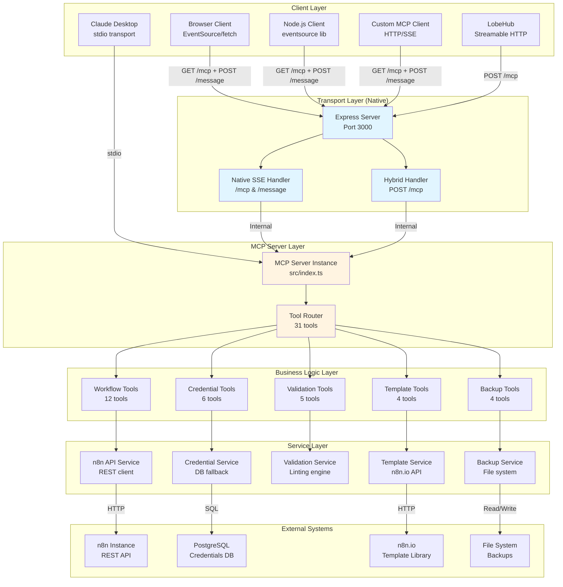
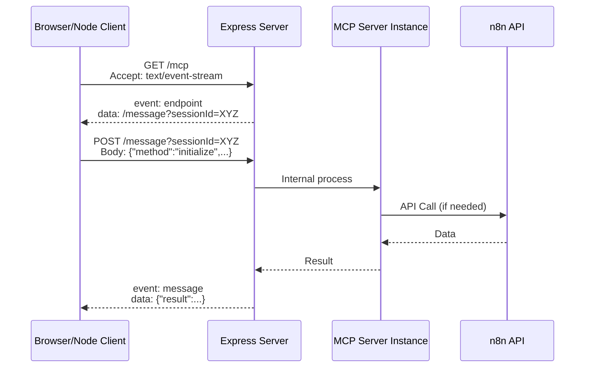
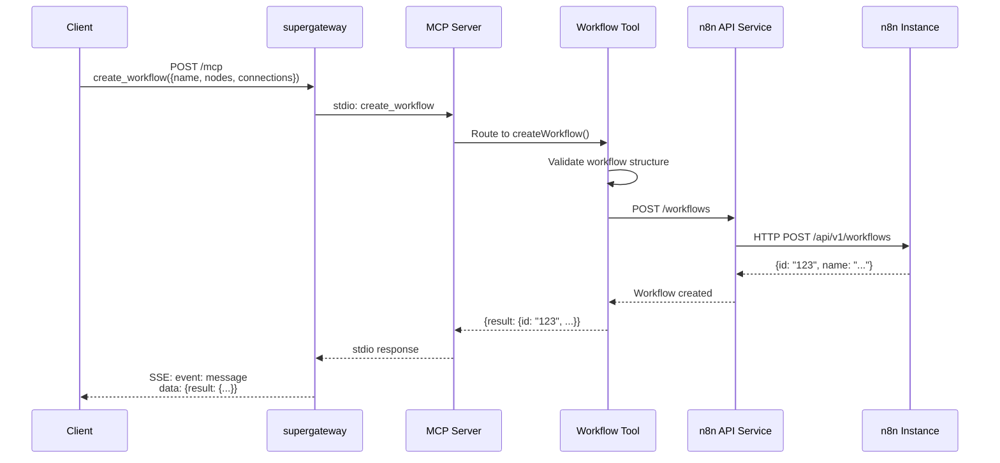
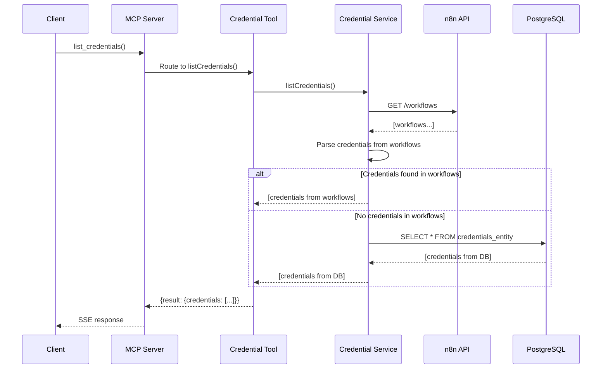
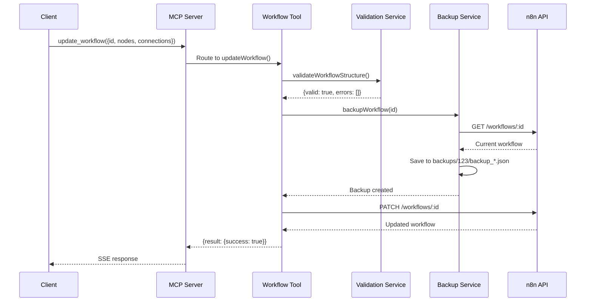
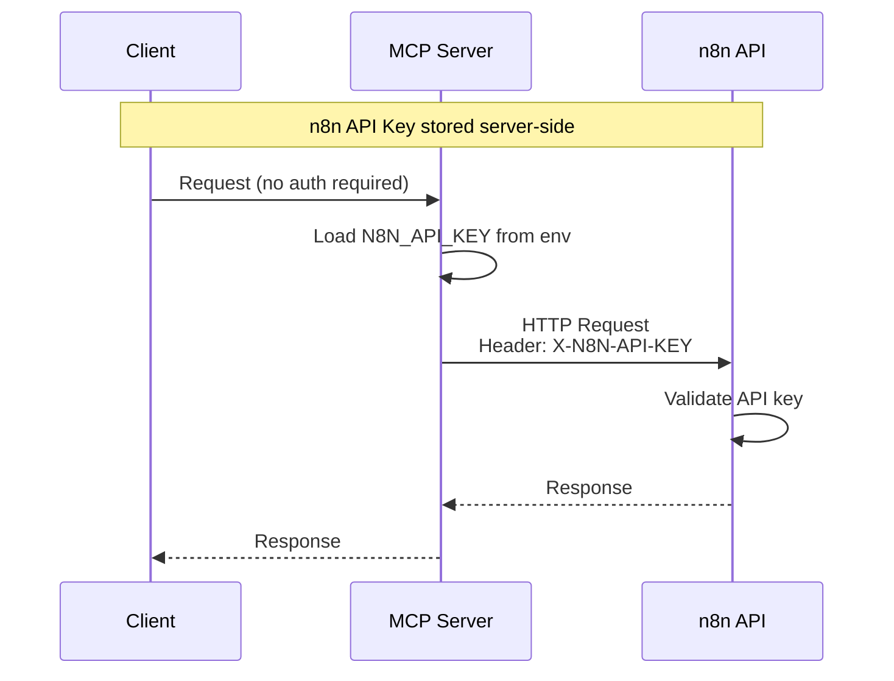
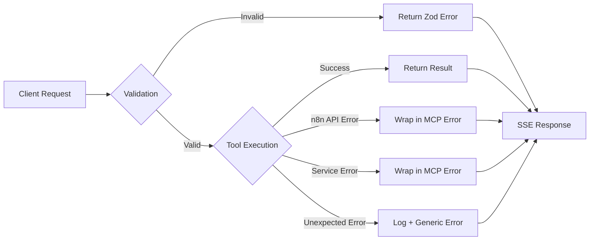

# System Architecture

**Version**: 2.2.0
**Last Updated**: 2026-02-12

---

## Overview

n8n-custom-mcp là một MCP (Model Context Protocol) server cung cấp 31 tools để quản lý n8n workflows, credentials, và executions. Server hỗ trợ cả stdio và **Native SSE (Server-Sent Events)** + **Hybrid Streamable HTTP** transport layers trực tiếp trong mã nguồn.

---

## Architecture Diagram



---

## SSE Transport Flow

### Request Flow (Client → Server)



### SSE Event Format

**Standard Response**:
```
event: message
data: {"jsonrpc":"2.0","result":{"tools":[...]},"id":1}

```

**Error Response**:
```
event: message
data: {"jsonrpc":"2.0","error":{"code":-32000,"message":"..."},"id":1}

```

**Notes**:
- Event type luôn là `message`
- Data field chứa full JSON-RPC 2.0 response
- Mỗi event kết thúc bằng 2 newlines (`\n\n`)
- Không có automatic event IDs (cần implement custom nếu cần resumability)

---

## Component Details

### 1. Transport Layer

#### Native Native SSE (v2.2.0+)
- **Role**: Tích hợp trực tiếp chuẩn MCP SSE (Server-Sent Events)
- **Features**:
  - Hỗ trợ đa session (new Server per session)
  - Hoạt động mượt mà với LobeHub qua POST /mcp
  - Không cần bridge trung gian
  - CORS sẵn có

#### StdioServerTransport
- **Role**: MCP SDK transport implementation
- **Package**: `@modelcontextprotocol/sdk`
- **Features**:
  - JSON-RPC 2.0 protocol
  - Bidirectional communication
  - Error handling

---

### 2. MCP Server Layer

#### Server Initialization
```typescript
// src/index.ts
const server = new Server(
  {
    name: "n8n-custom-mcp",
    version: "2.0.0",
  },
  {
    capabilities: {
      tools: {},
    },
  }
);
```

#### Tool Registration
```typescript
server.setRequestHandler(ListToolsRequestSchema, async () => ({
  tools: [
    ...workflowTools,
    ...credentialTools,
    ...validationTools,
    ...templateTools,
    ...backupTools,
    ...nodeTools,
  ],
}));
```

#### Request Routing
```typescript
server.setRequestHandler(CallToolRequestSchema, async (request) => {
  const { name, arguments: args } = request.params;

  // Route to appropriate tool handler
  switch (name) {
    case "list_workflows":
      return await listWorkflows(args);
    case "create_workflow":
      return await createWorkflow(args);
    // ... 29 more tools
  }
});
```

---

### 3. Business Logic Layer

#### Workflow Tools (12 tools)
- **File**: `src/tools/workflow-tools.ts`
- **Tools**: list, get, create, update, delete, activate, execute, trigger_webhook, list_executions, get_execution, list_node_types, validate_workflow_structure
- **Dependencies**: n8n API Service

#### Credential Tools (6 tools)
- **File**: `src/tools/credential-tools.ts`
- **Tools**: get_credential_schema, list, create, update, delete, test
- **Dependencies**: Credential Service, n8n API Service

#### Validation Tools (5 tools)
- **File**: `src/tools/validation-tools.ts`
- **Tools**: validate_structure, validate_credentials, validate_expressions, lint, suggest_improvements
- **Dependencies**: Validation Service

#### Template Tools (4 tools)
- **File**: `src/tools/template-tools.ts`
- **Tools**: search, get_details, import, export
- **Dependencies**: Template Service, n8n.io API

#### Backup Tools (4 tools)
- **File**: `src/tools/backup-tools.ts`
- **Tools**: backup, list_backups, restore, diff_versions
- **Dependencies**: Backup Service, File System

---

### 4. Service Layer

#### n8n API Service
```typescript
// src/services/n8n-api-service.ts
export const n8nClient = axios.create({
  baseURL: process.env.N8N_HOST,
  headers: {
    'X-N8N-API-KEY': process.env.N8N_API_KEY,
  },
});
```

**Endpoints Used**:
- `GET /workflows` - List workflows
- `GET /workflows/:id` - Get workflow details
- `POST /workflows` - Create workflow
- `PATCH /workflows/:id` - Update workflow
- `DELETE /workflows/:id` - Delete workflow
- `GET /executions` - List executions
- `GET /executions/:id` - Get execution details
- `GET /node-types` - List available nodes

#### Credential Service
```typescript
// src/services/credential-service.ts
export async function listCredentials() {
  // 1. Parse from workflows
  const workflowCredentials = await parseCredentialsFromWorkflows();

  // 2. Fallback to database
  if (workflowCredentials.length === 0) {
    return await queryCredentialsFromDatabase();
  }

  return workflowCredentials;
}
```

**Features**:
- Workflow parsing for credential discovery
- PostgreSQL fallback for direct DB access
- Schema validation against n8n credential types
- Safety checks for delete operations

#### Validation Service
```typescript
// src/services/validation-service.ts
export function validateWorkflowStructure(workflow) {
  return {
    valid: boolean,
    errors: ValidationError[],
    warnings: ValidationWarning[],
  };
}
```

**Validation Types**:
- **Structure**: JSON schema, node IDs, connections, circular dependencies
- **Credentials**: Credential existence, type matching, node requirements
- **Expressions**: JavaScript syntax, variable references, complexity
- **Linting**: Orphaned nodes, error handling, naming conventions, secrets
- **Suggestions**: Set nodes, batching, merge opportunities

#### Template Service
```typescript
// src/services/template-service.ts
export async function searchTemplates(query: string) {
  const response = await axios.get('https://api.n8n.io/templates', {
    params: { search: query },
  });
  return response.data;
}
```

**Features**:
- n8n.io template library integration
- Template caching for performance
- Dependency resolution during import
- Credential mapping for imported workflows

#### Backup Service
```typescript
// src/services/backup-service.ts
export async function backupWorkflow(workflowId: string) {
  const workflow = await getWorkflow(workflowId);
  const backupPath = `backups/${workflowId}/backup_${Date.now()}.json`;
  await fs.writeFile(backupPath, JSON.stringify(workflow, null, 2));
  return backupPath;
}
```

**Features**:
- File-based backup storage
- Automatic versioning (max 10 versions per workflow)
- Diff comparison between versions
- Auto-backup before destructive operations

---

## Data Flow Examples

### Example 1: Create Workflow



### Example 2: List Credentials with DB Fallback



### Example 3: Validate & Backup Before Update



---

## Configuration

### Environment Variables

```bash
# n8n Connection
N8N_HOST=http://n8n:5678
N8N_API_KEY=your-api-key-here

# Database (optional - for credential fallback)
DB_TYPE=postgresdb
DB_HOST=postgres
DB_PORT=5432
DB_DATABASE=n8n
DB_USERNAME=n8n
DB_PASSWORD=n8n
```

### Docker Compose

```yaml
services:
  n8n-mcp:
    build: .
    ports:
      - "3000:3000"
    environment:
      - N8N_HOST=${N8N_HOST}
      - N8N_API_KEY=${N8N_API_KEY}
      - DB_TYPE=${DB_TYPE}
      - DB_HOST=${DB_HOST}
      - DB_PORT=${DB_PORT}
      - DB_DATABASE=${DB_DATABASE}
      - DB_USERNAME=${DB_USERNAME}
      - DB_PASSWORD=${DB_PASSWORD}
    command: node dist/index.js
    environment:
      - N8N_HOST=${N8N_HOST}
      - N8N_API_KEY=${N8N_API_KEY}
      - MCP_TRANSPORT=sse
      - PORT=3000
    healthcheck:
      test: ["CMD", "curl", "-f", "http://localhost:3000/health"]
      interval: 30s
      timeout: 10s
      retries: 3
```

---

## Performance Characteristics

### Response Times (Average)

| Operation | Time | Notes |
|:----------|:-----|:------|
| list_workflows | 100-200ms | Depends on workflow count |
| get_workflow | 50-100ms | Single API call |
| create_workflow | 200-300ms | Includes validation |
| update_workflow | 300-500ms | Includes backup + validation |
| list_credentials | 150-250ms | Workflow parsing overhead |
| validate_workflow | 50-100ms | Pure computation |
| backup_workflow | 100-200ms | File I/O overhead |

### Scalability Considerations

**Bottlenecks**:
- n8n API rate limits (if any)
- PostgreSQL connection pool (for credential fallback)
- File system I/O (for backups)
- Workflow parsing (for large workflows)

**Optimizations**:
- Credential caching (reduce DB queries)
- Template caching (reduce n8n.io API calls)
- Backup rotation (limit to 10 versions)
- Validation memoization (cache validation results)

---

## Security Architecture

### Authentication Flow



### Security Layers

1. **Transport Security**:
   - CORS enabled (configurable origins)
   - HTTPS recommended for production
   - No authentication on MCP endpoint (internal use)

2. **API Security**:
   - n8n API key stored in environment variables
   - Never exposed to clients
   - Validated on every n8n API call

3. **Data Security**:
   - Credentials never logged
   - Backup files contain sensitive data (secure storage required)
   - Database credentials encrypted by n8n

4. **Input Validation**:
   - Zod schemas for all tool inputs
   - Workflow structure validation
   - SQL injection prevention (parameterized queries)

---

## Error Handling

### Error Flow



### Error Response Format

```json
{
  "jsonrpc": "2.0",
  "error": {
    "code": -32000,
    "message": "Workflow not found",
    "data": {
      "workflowId": "123",
      "originalError": "404 Not Found"
    }
  },
  "id": 1
}
```

---

## Monitoring & Observability

### Health Check

```bash
curl http://localhost:3000/health
```

**Response**:
```json
{
  "status": "healthy",
  "timestamp": "2026-02-12T07:38:50.000Z"
}
```

### Logging

**Log Levels**:
- `ERROR`: n8n API failures, validation errors
- `WARN`: Deprecated features, fallback usage
- `INFO`: Tool calls, workflow operations
- `DEBUG`: Request/response details (disabled in production)

**Log Format**:
```
[2026-02-12T07:38:50.000Z] INFO: Tool called: list_workflows
[2026-02-12T07:38:50.123Z] INFO: n8n API: GET /workflows (200 OK)
[2026-02-12T07:38:50.150Z] INFO: Response sent: 15 workflows
```

---

## Deployment Considerations

### Docker Deployment

**Advantages**:
- Isolated environment
- Consistent dependencies
- Easy scaling
- Health checks built-in

**Requirements**:
- Docker 20.10+
- Docker Compose 2.0+
- 512MB RAM minimum
- 1GB disk space (for backups)

### Kubernetes Deployment

**Example Manifest**:
```yaml
apiVersion: apps/v1
kind: Deployment
metadata:
  name: n8n-mcp
spec:
  replicas: 1
  selector:
    matchLabels:
      app: n8n-mcp
  template:
    metadata:
      labels:
        app: n8n-mcp
    spec:
      containers:
      - name: n8n-mcp
        image: n8n-custom-mcp:2.0.0
        ports:
        - containerPort: 3000
        env:
        - name: N8N_HOST
          valueFrom:
            configMapKeyRef:
              name: n8n-config
              key: host
        - name: N8N_API_KEY
          valueFrom:
            secretKeyRef:
              name: n8n-secrets
              key: api-key
        livenessProbe:
          httpGet:
            path: /health
            port: 3000
          initialDelaySeconds: 10
          periodSeconds: 30
```

---

## Future Enhancements

### Phase 2: Streaming Enhancements
- Progress notifications for long-running workflows
- Event IDs for resumability
- Custom SSE event types (progress, error, complete)

### Phase 3: Advanced Features
- WebSocket transport (bidirectional)
- Event replay buffer
- Connection multiplexing
- Rate limiting

### Phase 4: Observability
- Prometheus metrics
- OpenTelemetry tracing
- Structured logging
- Performance profiling

---

## References

- [MCP SDK for JavaScript](https://github.com/modelcontextprotocol/sdk-js)
- [n8n API Documentation](https://docs.n8n.io/api/)
- [Express.js SSE guide](https://expressjs.com/en/advanced/best-practice-performance.html)
- [Server-Sent Events Specification](https://html.spec.whatwg.org/multipage/server-sent-events.html)
- [JSON-RPC 2.0 Specification](https://www.jsonrpc.org/specification)
